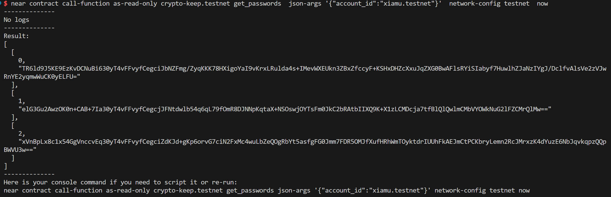
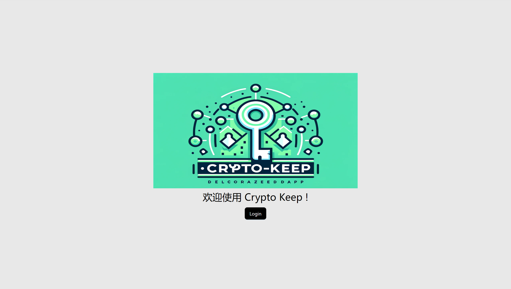
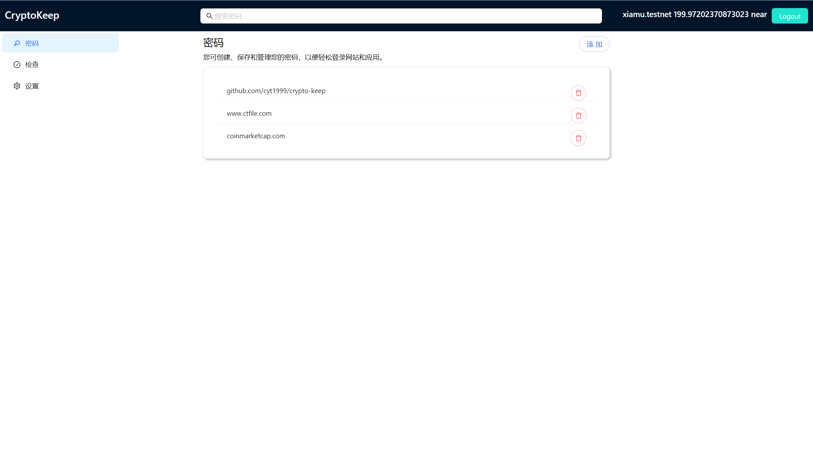
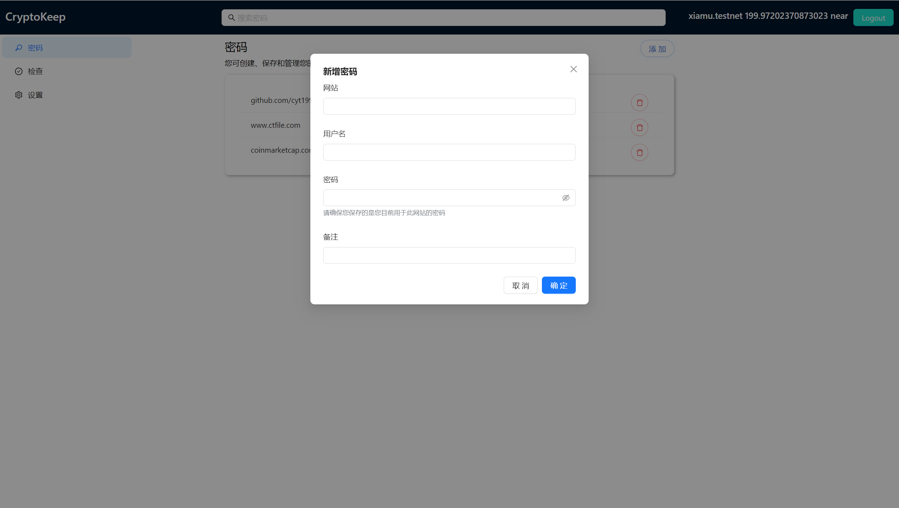
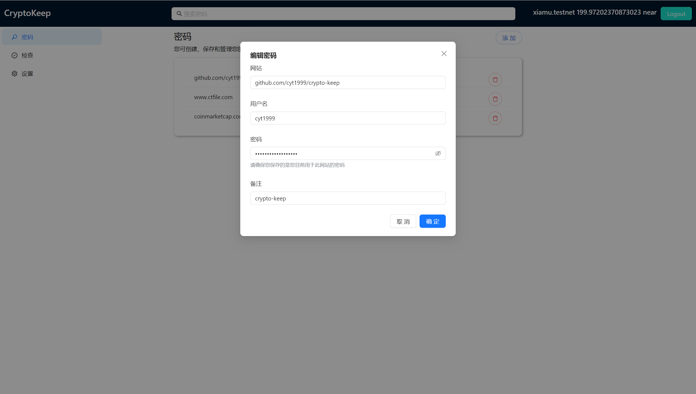

# Crypto Keep 

## 简介
一个密码管理工具，只有前端和合约，所有数据都是在链上存储，链上会存储密文，加解密的过程在用户浏览器完成。同时具备了去中心化的特性和安全性。

> 链上数据查询

## 前端页面展示
登录页面

首页

新增

编辑

## 待解决的问题
1、数据加解密的问题
加解密的过程一开始设想使用near账户的公私钥来完成，但后续发现near账户在登录app的时候，公私钥会有变化，导致之前加密后的数据，无法解密的情况。我还没有仔细研究near账户能不能实现这种场景的加解密，不过即使不行也可以通过在app里面去生成数据加密密钥给到用户使用。

2、考虑到一个合约存储过多的数据，可能会影响性能，是否可以使用工程合约，让用户可以部署一个自己使用的密码管理合约。待调研，只是了解到near支持工厂合约。

3、目前只是简单的实现了密码的增删改查，用户体验差，可借鉴现有web2 密码管理工具的解决方案。

